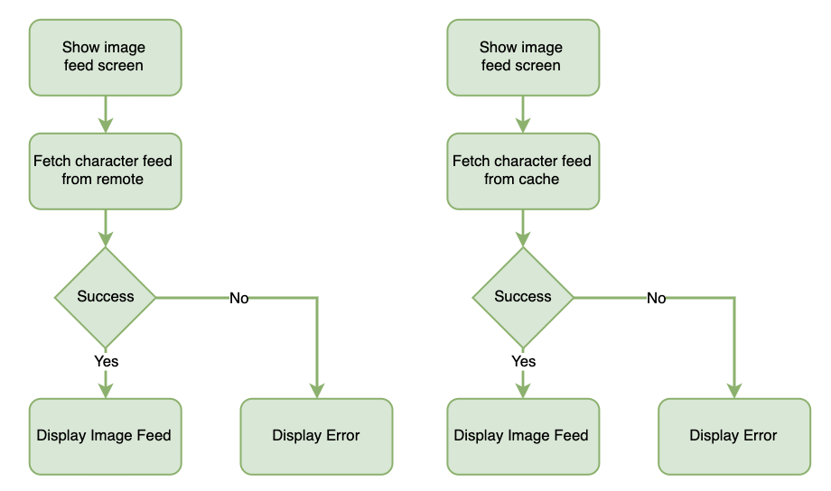
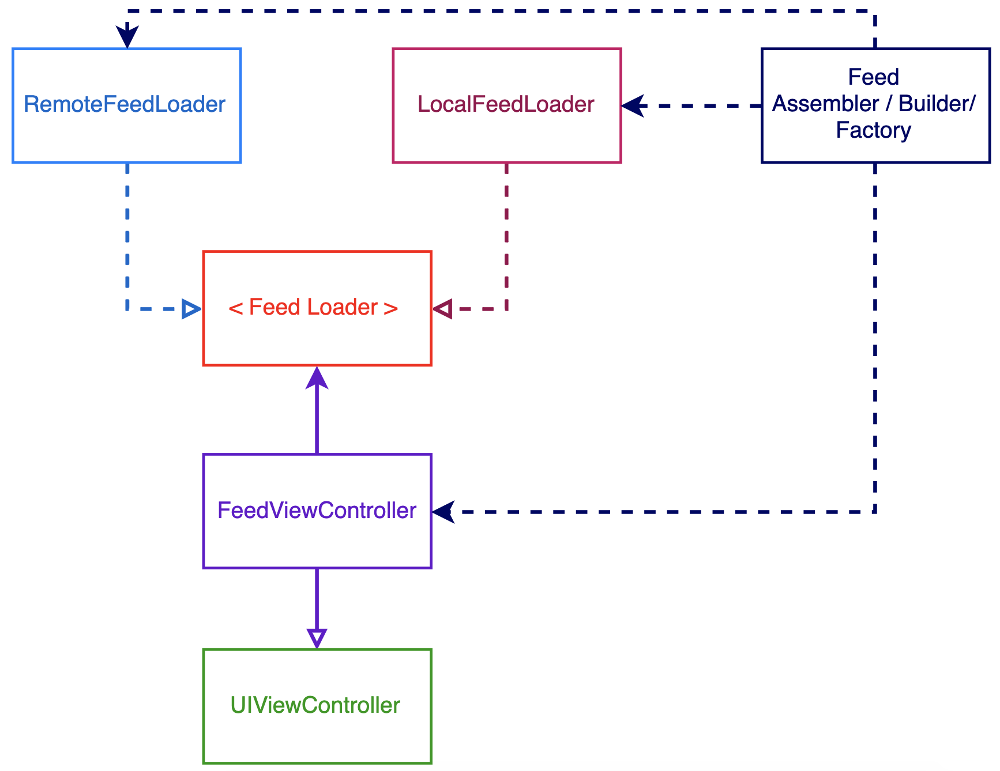

# Rick and Morty App – Character Feed Feature

## BDD Specs

### Story: Customer requests to see their image feed

### Narrative #1

> As an online customer
I want the app to automatically load characters feed
So I can always enjoy characters description
#### Scenarios (Acceptance criteria)

```
Given the customer has connectivity
When the customer requests to see feed
Then the app should display the feed from remote
```

### Narrative #2

> As an offline customer
I want the app to show my characters saved
So I can always enjoy my favorite characters
#### Scenarios (Acceptance criteria)

```
Given the customer doesn't have connectivity
And there’s a cached characters of the feed
When the customer requests to see saved feed
Then the app should display the latest characters saved
Given the customer doesn't have connectivity
And the cache is empty
When the customer requests to see the feed
Then the app should display an error message
```

## Use Cases

### Load Feed Use Case

#### Data:
- URL

#### Primary course (happy path):
1. Execute "Load Feed Items" command with above data.
2. System downloads data from the URL.
3. System validates downloaded data.
4. System creates feed items from valid data.
5. System delivers feed items.

#### Invalid data – error course (sad path):
1. System delivers error.

#### No connectivity – error course (sad path):
1. System delivers error.

### Load Feed Fallback (Cache) Use Case

#### Data:
- Cache

#### Primary course:
1. Execute "Retrieve Feed Items" command with above data.
2. System fetches feed data from cache.
3. System creates feed items from cached data.
4. System delivers feed items.

#### Empty cache course (sad path): 
1. System delivers no feed items.


### Save Feed Items Use Case

#### Data:
- Feed items

#### Primary course (happy path):
1. Execute "Save Feed Items" command with above data.
2. System encodes feed items.
3. System add charaters in the cache with new data.
4. System delivers success message.

## Flowchart



## Architecture



## Model Specs

### Feed Item

| Property      | Type               |
|---------------|--------------------|
| `nextPage`    | `URL`              |
| `characters`  | `[Character]`      |

### Character Item

| Property      | Type      |
|---------------|-----------|
| `name`    | `String`      |
| `status`  | `String`      |
| `species` | `String`      |
| `image`   | `URL`			 |

### Payload contract

```
GET *url*
200 RESPONSE
{
	"info": 
		{
			"next": "https://url.com"
		},
	"results" [
		{
			"name": "a name",
			"status": "a status",
			"species": "a species",
			"image": "https://image-url.com"
		},
		...
	]
}
```